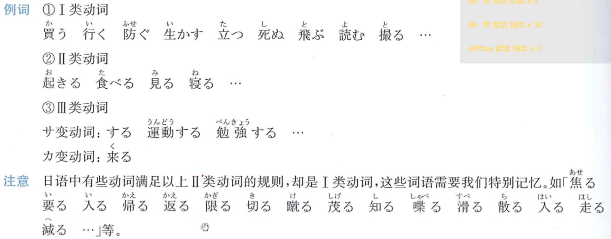
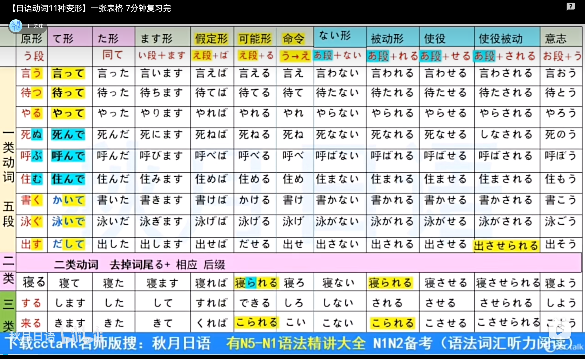
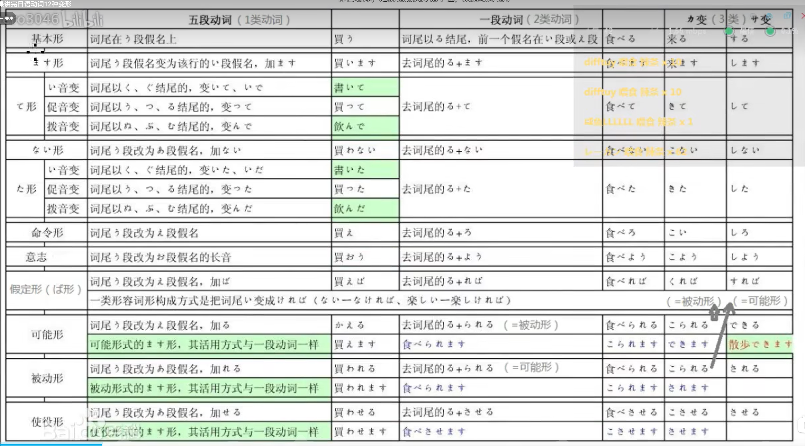

# N5 Note

- [N5 Note](#n5-note)
  - [名词和形容词用法](#名词和形容词用法)
    - [名词+2类形容词](#名词2类形容词)
    - [名词+1类形容词](#名词1类形容词)
    - [时态总结表](#时态总结表)
  - [动词用法](#动词用法)
    - [敬体（ます形）四种时态](#敬体ます形四种时态)
    - [简体（普通体）四种时态](#简体普通体四种时态)
    - [て形及其用法](#て形及其用法)
    - [た形及其用法](#た形及其用法)
    - [ない形及其用法](#ない形及其用法)
  - [助词和助词用法](#助词和助词用法)
  - [动词变形整理](#动词变形整理)
  - [N5 时态用法详解](#n5-时态用法详解)
  - [N5 重点单词](#n5-重点单词)

## 名词和形容词用法

> 日语的时态分为**过去时**和**非过去时（现在·将来）**。非过去时同时表示现在习惯和将来动作。
> 日语没有单独的将来时，通过时间词（如「明日」「来週」）来区分现在和将来。

### 名词+2类形容词

> **2类形容词（な形容词）** 和**名词**的时态变化规则相同。
> 肯定形用「です/だった」，否定形用「ではない/ではなかった」。

| 时态 | 肯定 | 否定 |
|------|------|------|
| 现在·将来（非过去） | ～は～です | ～は～ではありません |
| 过去 | ～は～でした | ～は～ではありませんでした |

例句：
- 私は学生です。（わたしはがくせいです）- 我是学生。
- 私は学生でした。- 我曾是学生。
- 私は学生ではありません。- 我不是学生。
- 私は学生ではありませんでした。- 我以前不是学生。

### 名词+1类形容词

> **1类形容词（い形容词）** 的时态变化不同于名词/2类形容词。
> 过去时将词尾「い」变为「かった」，否定时变为「くない」。
> **注意：** 1类形容词不能用「でした」做过去时（如「高かったです」而非「高いでした」）。

| 时态 | 肯定 | 否定 |
|------|------|------|
| 现在·将来 | ～は～いです | ～は～くないです |
| 过去 | ～は～かったです | ～は～くなかったです |

例句：
- この本は高いです。（このほんはたかいです）- 这本书很贵。
- この本は高かったです。- 这本书以前很贵。
- この本は高くないです。- 这本书不贵。
- この本は高くなかったです。- 这本书以前不贵。

**特殊变化：** 「いい（好）」的过去时为「よかった」，否定为「よくない」。

### 时态总结表

| 品词 | 现在·将来（肯定） | 现在·将来（否定） | 过去（肯定） | 过去（否定） |
|------|------|------|------|------|
| 名词/2类形容词 | です | ではありません | でした | ではありませんでした |
| 1类形容词 | ～いです | ～くないです | ～かったです | ～くなかったです |
| 动词（敬体） | ～ます | ～ません | ～ました | ～ませんでした |

## 动词用法

> 日语动词分为3类：**1类（五段动词/う段）**、**2类（一段动词/る结尾）**、**3类（する/くる不规则动词）**。
> 动词有**敬体（です/ます）** 和**简体（だ/辞書形）** 两种语体。

～をします。（做～）
～をしました。（做了～）
～をしません。（不做～）
～をしませんでした。（没做～）

### 敬体（ます形）四种时态

> 敬体用于正式场合、与不熟的人交谈、职场等。
> 由动词词干（ます词干）+ ます/ません/ました/ませんでした 构成。

| 时态 | 形式 | 例（のむ/喝） | 例（たべる/吃） |
|------|------|------|------|
| 现在·将来肯定 | V词干+ます | のみます | たべます |
| 现在·将来否定 | V词干+ません | のみません | たべません |
| 过去肯定 | V词干+ました | のみました | たべました |
| 过去否定 | V词干+ませんでした | のみませんでした | たべませんでした |

**词干变化规则：**
- **1类动词：** 词尾う段→い段（のむ→のみ、かく→かき、いく→いき）
- **2类动词：** 去掉る（たべる→たべ、みる→み）
- **3类动词：** する→し、くる→き

### 简体（普通体）四种时态

> 简体用于朋友、家人之间的口语交流，也是词典中收录的形式。

| 时态 | 形式 | 例（のむ/喝） | 例（たべる/吃） | 例（する/做） |
|------|------|------|------|------|
| 现在·将来肯定 | 辞書形 | のむ | たべる | する |
| 现在·将来否定 | ない形 | のまない | たべない | しない |
| 过去肯定 | た形 | のんだ | たべた | した |
| 过去否定 | なかった形 | のまなかった | たべなかった | しなかった |

例句：
- 毎日新聞を読む。（まいにちしんぶんをよむ）- 每天读报纸。（习惯性现在时）
- 毎日新聞を読まない。- 每天不读报纸。
- 昨日映画を見た。（きのうえいがをみた）- 昨天看了电影。（过去时）
- 昨日映画を見なかった。- 昨天没看电影。

### て形及其用法

> **て形** 是日语语法的核心，用于连接动作、请求、持续状态等。
> 1类动词的て形变化规则与た形完全相同（て→た、で→だ）。

**1类动词て形变化规则：**

| 词尾 | 变化 | 例 |
|------|------|------|
| く | →いて | かく→かいて（書いて） |
| ぐ | →いで | およぐ→およいで（泳いで） |
| う・つ・る | →って | かう→かって、まつ→まって |
| ぬ・む・ぶ | →んで | のむ→のんで、あそぶ→あそんで |
| す | →して | はなす→はなして |
| **特例：いく** | →いって | いく→いって（行って） |

**2类动词：** る→て（たべる→たべて、みる→みて）
**3类动词：** する→して、くる→きて

**て形用法：**

1. **てください（请求）**
   - すわってください。（请坐。）
   - すわらないでください。（请不要坐。）← 否定请求用「ないでください」

2. **ています（正在进行/状态）**
   - あめがふっています。（下雨了。）
   - 私はしんぶんをよんでいます。（我正在读报纸。）

3. **てもいい（许可）**
   - たばこをすってもいいですか。（可以抽烟吗？）

4. **てはいけません（禁止）**
   - ここでたばこをすってはいけません。（这里禁止抽烟。）

5. **て、（顺序连接）**
   - パンをたべて、コーヒーをのみます。（吃面包，然后喝咖啡。）

### た形及其用法

> **た形** 表示过去或完成。变化规则与て形完全一致，只是「て→た」「で→だ」。

1. **なかった形（过去否定形）** - 形容词1的过去否定规则
   - のまなかった（没喝）

2. **～たことがあります（有过经验）**
   - 富士山にのぼったことがあります。（ふじさんにのぼったことがあります）- 我爬过富士山。

3. **～たり～たりします（列举动作）**
   - 週末はさんぽしたり、おんがくをきいたりします。- 周末散步、听音乐等。

4. **～たら（条件假定）**
   - あめがふったら、いきません。- 下雨的话就不去了。

5. **～たほうがいい（建议，最好～）**
   - はやくねたほうがいいです。- 最好早点睡。

### ない形及其用法

> **ない形** 是动词的否定形式，词尾变为あ段+ない。
> **特例：** ある→ない（不是あらない）

1. **～ないでください（否定请求）**
   - すわらないでください。（请不要坐。）

2. **～なければなりません（必须）**
   - くすりをのまなければなりません。（必须吃药。）

3. **～なくてもいい（不必）**
   - きょうはいかなくてもいいです。（今天不用去。）

## 助词和助词用法

は、も、と、か、
を、が、の、で、に、や、

から～まで

少し（すこし）、ちょっと

| 助词 | 读音 | 用法 | 例句 |
|------|------|------|------|
| は | wa | 提示主题 | 私は学生です。（我是学生。） |
| が | ga | 提示主语/新信息 | 犬がいます。（有狗。） |
| を | wo | 提示宾语 | ごはんをたべます。（吃饭。） |
| に | ni | 时间/地点/方向 | 7時に起きます。（7点起床。） |
| で | de | 动作场所/手段 | 図書館で本をよみます。（在图书馆读书。） |
| と | to | 和/与/引用 | 友達と行きます。（和朋友去。） |
| も | mo | 也 | 私も行きます。（我也去。） |
| の | no | 的/所属 | 私の本です。（我的书。） |
| か | ka | 疑问 | 学生ですか。（是学生吗？） |
| や | ya | 列举（不完全） | りんごやみかんをかいます。（买苹果、橘子等。） |
| から | kara | 从～/因为 | 9時から始まります。（从9点开始。） |
| まで | made | 到～ | 5時まで働きます。（工作到5点。） |
| へ | e | 方向 | 学校へ行きます。（去学校。） |

**常见用法：**

1. ～に何があります／～に誰がいます。（在某地有某物/某人）
   - 部屋に机があります。（房间里有一张桌子。）
   - 公園に子供がいます。（公园里有孩子。）

2. ～が欲しい／～がしたい。（想要～/想做～）
   - 水が欲しいです。（想喝水。）
   - テニスがしたいです。（想打网球。）

3. ～と思います、～と言います、～と考えいます。（认为～/说～）
   - 明日は晴れると思います。（我认为明天是晴天。）
   - 先生は「勉強しなさい」と言いました。（老师说「请学习」。）

4. あげる、もらう、くれる。（给/接受/给我）
   - 友達にプレゼントをあげます。（给朋友礼物。）
   - 友達にプレゼントをもらいます。（从朋友那里得到礼物。）
   - 友達がプレゼントをくれました。（朋友给了我礼物。）

## 动词变形整理

- 1-2-3类动词
   1. 1类动词（五段动词）：词尾是「う、く、ぐ、す、つ、ぬ、ぶ、む、る」，且倒数第二个假名一般是「あ、う、お」段假名
   2. 2类动词（一段动词）：词尾必须是「る」，且倒数第二个假名为「い、え」段假名
   _**起きる、食べる、見る、寝る、居（い）る、教える、届（とど）ける、あげる、あける、煮（に）る、炒（いた）める、かける  **_

   3. 3类动词（サ変動詞・カ変動詞）：サ変動詞一般指「する」，和サ変复合词，カ変動詞ー「来る」

> **易混淆动词（看起来像2类但实际是1类）：**
> かえる（帰る，回去）、はいる（入る，进入）、はしる（走る，跑）、しる（知る，知道）

- 自动词和他动词

> **自动词** 不带宾语，表示状态变化（窓が開く，窗子开了）。
> **他动词** 带宾语，表示人为动作（窓を開ける，开窗子）。

1. ます形(礼貌体)
   1. 動詞１：う→い段＋ます
   2. 動詞２：る→ます
   3. 動詞３：する→します、くる→きます
2. て形/た形
   1. 動詞１：く・ぐ→いて・いで、う・つ・る→って、ぬ・む→んで、**いく→いって**
   2. 動詞２：る→て、る→た
   3. 動詞３：する→して・した、くる→きて・きた
3. う→あ　(未然，被动形，使役形)
   1. ない：あ段＋ない、＋ない、　＋しない、くる→こない、**ある→ない**、**買う→買わない**
    なかった：形容詞１のルール
   2. 受動（じゅどう）：あ段＋れる、＋られる、＋される、来る→こられる
   3. 使役（しえき）：　あ段＋せる、＋させる、＋させる、くる→こらせる
   4. 使役受動させる：あ段段＋させる、＋させられる、＋させられる、来る→こさせられる
   5. 要訣（ようけつ）：**受動れる・られる・こられる・される、使役せる・させる・こらせる・させる**
4. う→え　(命令，假定形，可能形)
   1. 命令（めいれい）：う→え段、　　る→ろ、　　する→しろ、　来る→こい　　
   2. 仮定（かてい）：**う→え段＋ば、Aい→Aければ**、形容２／名詞＋な→ならば・なら、である→であれば
   3. 可能（かのう）：う→え段＋る、る→られる、する→できる、来る→こられる
   4. 要訣：**可能える・られる・こられる・できる、仮定えば・ければ**
5. う→お　　
   1. 意志（いし）：う→お段＋う、　る→よう、　する→しよう、　くる→こよう

## N5 时态用法详解

> 本节对 N5 级别所需的时态进行系统梳理，重点说明日语时态与中文的差异。

### 一、日语时态的基本特征

日语时态只有两种：**过去时（過去形）** 和 **非过去时（非過去形）**。

| 中文概念 | 日语对应 | 说明 |
|------|------|------|
| 现在时 | 非过去形 | ます/辞書形 |
| 将来时 | 非过去形 | ます/辞書形（通过时间词区分） |
| 过去时 | 過去形 | ました/た形 |

**关键区别：** 日语没有单独的将来时，现在和将来共用同一种形式，靠时间词（明日、来週、来年）来区分。

### 二、敬体 vs 简体

| | 敬体（ていねい体） | 简体（ふつう体） |
|------|------|------|
| 使用场合 | 正式场合、职场、陌生人 | 朋友、家人、日记 |
| 名词肯定 | です | だ |
| 动词肯定 | ます | 辞書形 |
| 形容词肯定 | ～いです | ～い |

### 三、各品词时态对照表

#### 3.1 名词・2类形容词（な形容词）

| 时态 | 敬体肯定 | 敬体否定 | 简体肯定 | 简体否定 |
|------|------|------|------|------|
| 非过去 | です | ではありません | だ | ではない |
| 过去 | でした | ではありませんでした | だった | ではなかった |

例：静か（しずか，安静）
- 静かです（安静）
- 静かではありません（不安静）
- 静かでした（以前安静）
- 静かではありませんでした（以前不安静）

#### 3.2 1类形容词（い形容词）

| 时态 | 敬体肯定 | 敬体否定 | 简体肯定 | 简体否定 |
|------|------|------|------|------|
| 非过去 | ～いです | ～くないです | ～い | ～くない |
| 过去 | ～かったです | ～くなかったです | ～かった | ～くなかった |

例：高い（たかい，贵）
- 高いです（贵）
- 高くないです（不贵）
- 高かったです（以前贵）
- 高くなかったです（以前不贵）

> **易错点：** 1类形容词的过去时不能加「でした」（「高いでした」是错误的），要用「高かったです」。

#### 3.3 动词

| 时态 | 敬体肯定 | 敬体否定 | 简体肯定 | 简体否定 |
|------|------|------|------|------|
| 非过去 | 〜ます | 〜ません | 辞書形 | ない形 |
| 过去 | 〜ました | 〜ませんでした | た形 | なかった形 |

例：飲む（のむ，喝）
- 飲みます（喝/将要喝）
- 飲みません（不喝/将不喝）
- 飲みました（喝了）
- 飲みませんでした（没喝）

### 四、て形与时态的关联

て形本身不表示时态，但与后续补助动词结合可表达不同的时间含义：

| 句型 | 时态含义 | 例句 |
|------|------|------|
| 〜ています | 正在进行 | ごはんをたべています。（正在吃饭。） |
| 〜ています | 结果状态 | 結婚しています。（已婚。） |
| 〜ました | 过去完成 | ごはんをたべました。（吃了饭。） |
| 〜てから | 做完〜之后 | しゅくだいをしてからあそびます。（做完作业后玩。） |
| まだ〜ていません | 尚未完成 | まだたべていません。（还没吃。） |

> **まだ（尚未）** 必须搭配「〜ていません」使用，不能用过去时「ました」。
> 正例：まだ食べていません。（还没吃。）
> 错例：まだ食べました。（×）

### 五、た形的拓展用法

た形不只是过去时，还参与多种固定句型：

| 句型 | 含义 | 例句 |
|------|------|------|
| 〜たことがある | 有过经验 | 日本へ行ったことがあります。（去过日本。） |
| 〜たほうがいい | 最好〜 | 薬を飲んだほうがいいです。（最好吃药。） |
| 〜たら | 如果/〜之后 | 雨が降ったら、行きません。（下雨就不去。） |
| 〜たり〜たりする | 列举 | 本を読んだり、テレビを見たりします。（读书、看电视等。） |
| 〜たばかり | 刚刚〜 | 食べたばかりです。（刚吃完。） |
| 〜たところ | 刚好做完 | 今、着いたところです。（刚到。） |

### 六、时间词与时态的配合

日语中，时间词决定了句子的时态方向：

| 时间词 | 读音 | 配合时态 |
|------|------|------|
| 今日 | きょう | 现在/过去 |
| 明日 | あした | 非过去（将来） |
| 昨日 | きのう | 过去 |
| 毎日 | まいにち | 非过去（习惯） |
| 今 | いま | 现在 |
| あさって | あさって | 非过去（将来，后天） |

> **注意：** 相对时间词（明日、昨日、毎日）后面**不加「に」**，但具体时刻（7時、3月）后面**要加「に」**。

## N5 重点单词

> 以下为 N5 高频词汇，按类别整理，附带假名读音和罗马音。

### 日常动词

| 单词 | 读音 | 罗马音 | 词性 | 中文 |
|------|------|------|------|------|
| 行く | いく | iku | 1类 | 去 |
| 来る | くる | kuru | 3类 | 来 |
| 食べる | たべる | taberu | 2类 | 吃 |
| 飲む | のむ | nomu | 1类 | 喝 |
| 見る | みる | miru | 2类 | 看 |
| 聞く | きく | kiku | 1类 | 听/问 |
| 読む | よむ | yomu | 1类 | 读 |
| 書く | かく | kaku | 1类 | 写 |
| 話す | はなす | hanasu | 1类 | 说 |
| 買う | かう | kau | 1类 | 买 |
| する | する | suru | 3类 | 做 |
| 会う | あう | au | 1类 | 见/见面 |
| 待つ | まつ | matsu | 1类 | 等 |
| 使う | つかう | tsukau | 1类 | 使用 |
| 作る | つくる | tsukuru | 1类 | 制作 |
| 教える | おしえる | oshieru | 2类 | 教 |
| 分かる | わかる | wakaru | 1类 | 明白/懂 |
| 忘れる | わすれる | wasureru | 2类 | 忘记 |
| 開ける | あける | akeru | 2类 | 打开 |
| 閉める | しめる | shimeru | 2类 | 关闭 |
| 寝る | ねる | neru | 2类 | 睡觉 |
| 起きる | おきる | okiru | 2类 | 起床 |
| 入る | はいる | hairu | 1类 | 进入 |
| 出る | でる | deru | 2类 | 出去 |
| 帰る | かえる | kaeru | 1类 | 回去 |
| 住む | すむ | sumu | 1类 | 居住 |
| 泳ぐ | およぐ | oyogu | 1类 | 游泳 |
| 遊ぶ | あそぶ | asobu | 1类 | 玩 |
| 働く | はたらく | hataraku | 1类 | 工作 |
| 勉強する | べんきょうする | benkyou suru | 3类 | 学习 |
| 歩く | あるく | aruku | 1类 | 走路 |
| 持つ | もつ | motsu | 1类 | 拿/持 |
| あげる | あげる | ageru | 2类 | 给（别人） |
| もらう | もらう | morau | 1类 | 收到 |
| くれる | くれる | kureru | 2类 | 给（我） |

### 时间词

| 单词 | 读音 | 罗马音 | 中文 |
|------|------|------|------|
| 今日 | きょう | kyou | 今天 |
| 明日 | あした | ashita | 明天 |
| 昨日 | きのう | kinou | 昨天 |
| あさって | あさって | asatte | 后天 |
| 毎日 | まいにち | mainichi | 每天 |
| 今 | いま | ima | 现在 |
| 朝 | あさ | asa | 早上 |
| 昼 | ひる | hiru | 白天/中午 |
| 夜 | よる | yoru | 晚上 |
| 今朝 | けさ | kesa | 今天早上 |
| 今晩 | こんばん | konban | 今天晚上 |
| 今週 | こんしゅう | konshuu | 这周 |
| 来週 | らいしゅう | raishuu | 下周 |
| 先週 | せんしゅう | senshuu | 上周 |
| 今月 | こんげつ | kongetsu | 这个月 |
| 来月 | らいげつ | raigetsu | 下个月 |
| 今年 | ことし | kotoshi | 今年 |
| 去年 | きょねん | kyonen | 去年 |
| 春 | はる | haru | 春天 |
| 夏 | なつ | natsu | 夏天 |
| 秋 | あき | aki | 秋天 |
| 冬 | ふゆ | fuyu | 冬天 |

### 数词

| 单词 | 读音 | 罗马音 | 中文 |
|------|------|------|------|
| 一 | いち | ichi | 1 |
| 二 | に | ni | 2 |
| 三 | さん | san | 3 |
| 四 | し/よん | shi/yon | 4 |
| 五 | ご | go | 5 |
| 六 | ろく | roku | 6 |
| 七 | しち/なな | shichi/nana | 7 |
| 八 | はち | hachi | 8 |
| 九 | きゅう/く | kyuu/ku | 9 |
| 十 | じゅう | juu | 10 |
| 百 | ひゃく | hyaku | 100 |
| 千 | せん | sen | 1,000 |
| 万 | まん | man | 10,000 |

**数量词（助数词）：**

| 助数词 | 读音 | 用途 | 例 |
|------|------|------|------|
| 〜人 | にん | 人数 | 3人（さんにん，3人） |
| 〜枚 | まい | 扁平物（纸/衣） | 2枚（にまい，2张） |
| 〜本 | ほん | 细长物（笔/瓶） | 1本（いっぽん，1根） |
| 〜個 | こ | 小物品 | 4個（よんこ，4个） |
| 〜匹 | ひき | 小动物 | 1匹（いっぴき，1只） |
| 〜階 | かい | 楼层 | 3階（さんがい，3层） |
| 〜歳 | さい | 年龄 | 20歳（はたち，20岁） |

### 家族称呼

| 中文 | 自己家人（谦让） | 读音 | 别人家（尊敬） | 读音 |
|------|------|------|------|------|
| 父亲 | 父 | ちち | お父さん | おとうさん |
| 母亲 | 母 | はは | お母さん | おかあさん |
| 哥哥 | 兄 | あに | お兄さん | おにいさん |
| 姐姐 | 姉 | あね | お姉さん | おねえさん |
| 弟弟 | 弟 | おとうと | 弟さん | おとうとさん |
| 妹妹 | 妹 | いもうと | 妹さん | いもうとさん |
| 家人 | 家族 | かぞく | — | — |
| 父母 | 両親 | りょうしん | — | — |
| 孩子 | 子供 | こども | — | — |
| 朋友 | 友達 | ともだち | — | — |

### 场所

| 单词 | 读音 | 罗马音 | 中文 |
|------|------|------|------|
| 学校 | がっこう | gakkou | 学校 |
| 会社 | かいしゃ | kaisha | 公司 |
| 病院 | びょういん | byouin | 医院 |
| 駅 | えき | eki | 车站 |
| 銀行 | ぎんこう | ginkou | 银行 |
| 図書館 | としょかん | toshokan | 图书馆 |
| 店 | みせ | mise | 店铺 |
| 空港 | くうこう | kuukou | 机场 |
| 家 | いえ | ie | 家 |
| 部屋 | へや | heya | 房间 |
| トイレ | トイレ | toire | 厕所 |
| 公園 | こうえん | kouen | 公园 |

### 形容词

**1类形容词（い形容词）：**

| 单词 | 读音 | 罗马音 | 中文 |
|------|------|------|------|
| 高い | たかい | takai | 高的/贵的 |
| 安い | やすい | yasui | 便宜的 |
| 大きい | おおきい | ookii | 大的 |
| 小さい | ちいさい | chiisai | 小的 |
| 新しい | あたらしい | atarashii | 新的 |
| 古い | ふるい | furui | 旧的 |
| 暑い | あつい | atsui | 热的（天气） |
| 寒い | さむい | samui | 冷的（天气） |
| 赤い | あかい | akai | 红色的 |
| 青い | あおい | aoi | 蓝色的 |
| いい | いい | ii | 好的（过去：よかった） |
| 難しい | むずかしい | muzukashii | 难的 |
| 易しい | やさしい | yasashii | 容易的/温柔的 |
| 広い | ひろい | hiroi | 宽广的 |
| 狭い | せまい | semai | 狭窄的 |

**2类形容词（な形容词）：**

| 单词 | 读音 | 罗马音 | 中文 |
|------|------|------|------|
| 静か | しずか | shizuka | 安静的 |
| 元気 | げんき | genki | 精神好的/健康的 |
| 有名 | ゆうめい | yuumei | 有名的 |
| 便利 | べんり | benri | 便利的 |
| 簡単 | かんたん | kantan | 简单的 |
| 好き | すき | suki | 喜欢的 |
| 暇 | ひま | hima | 空闲的 |
| 大変 | たいへん | taihen | 辛苦的 |
| きれい | きれい | kirei | 漂亮的/干净的 |
| 大切 | たいせつ | taisetsu | 重要的 |
| 複雑 | ふくざつ | fukuzatsu | 复杂的 |

### 代词与疑问词

| 单词 | 读音 | 罗马音 | 中文 |
|------|------|------|------|
| 私 | わたし | watashi | 我 |
| あなた | あなた | anata | 你 |
| 彼 | かれ | kare | 他 |
| 彼女 | かのじょ | kanojo | 她/女朋友 |
| 私たち | わたしたち | watashitachi | 我们 |
| この | この | kono | 这个（近） |
| その | その | sono | 那个（中） |
| あの | あの | ano | 那个（远） |
| どの | どの | dono | 哪个 |
| ここ | ここ | koko | 这里 |
| そこ | そこ | soko | 那里（中） |
| あそこ | あそこ | asoko | 那里（远） |
| どこ | どこ | doko | 哪里 |
| 何 | なに/なん | nani/nan | 什么 |
| 誰 | だれ | dare | 谁 |
| いつ | いつ | itsu | 什么时候 |
| どう | どう | dou | 怎么样 |
| なぜ/どうして | なぜ/どうして | naze/doushite | 为什么 |
| いくら | いくら | ikura | 多少钱 |
| いくつ | いくつ | ikutsu | 几个/几岁 |
