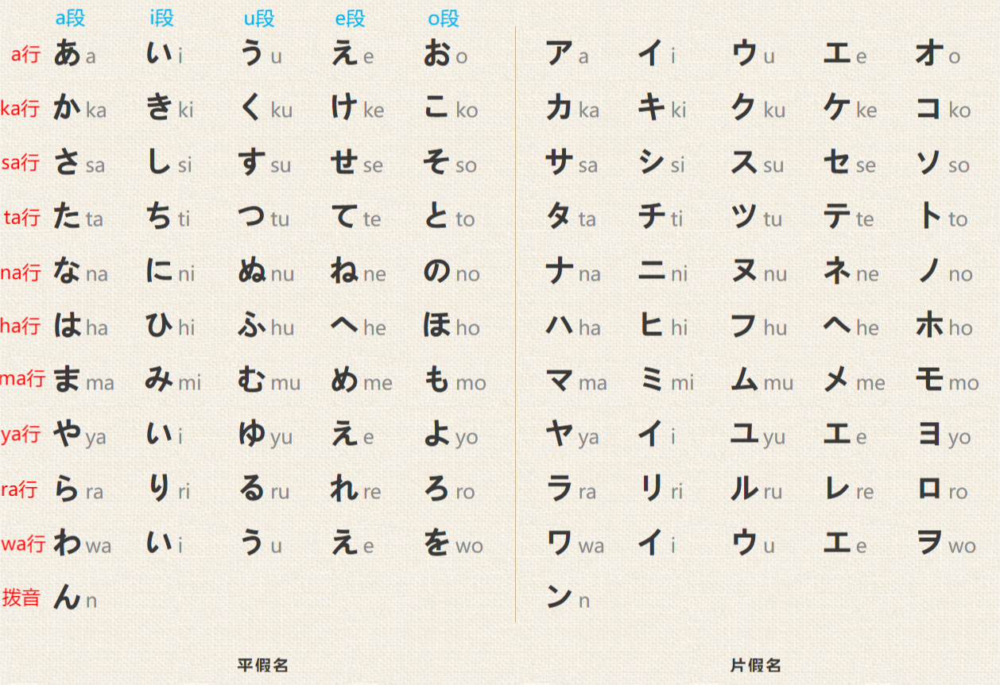
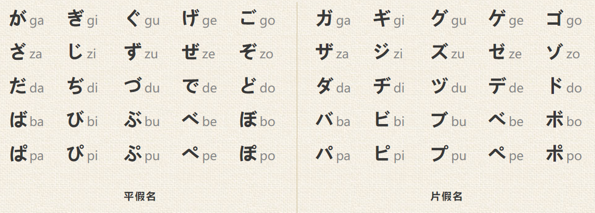
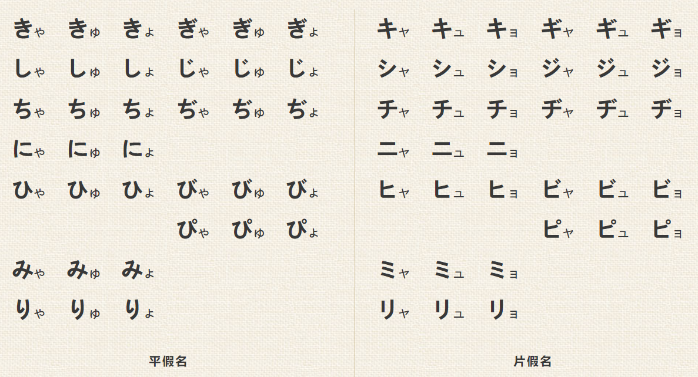

# 五十音图基础

- [五十音图基础](#五十音图基础)
  - [日语的文字系统](#日语的文字系统)
  - [五十音图（ごじゅうおんず）](#五十音图ごじゅうおんず)
  - [清音（せいおん）](#清音せいおん)
    - [平假名完整表](#平假名完整表)
    - [片假名完整表](#片假名完整表)
  - [浊音（だくおん）](#浊音だくおん)
  - [半浊音（はんだくおん）](#半浊音はんだくおん)
  - [拗音（ようおん）](#拗音ようおん)
  - [促音（そくおん）与长音（ちょうおん）](#促音そくおん与长音ちょうおん)
    - [促音](#促音)
    - [长音](#长音)
  - [记忆方法](#记忆方法)
    - [1. 清音记忆](#1-清音记忆)
    - [2. 浊音和半浊音记忆](#2-浊音和半浊音记忆)
    - [3. 拗音记忆](#3-拗音记忆)
    - [4. 学习建议](#4-学习建议)
  - [常用日语交流语句](#常用日语交流语句)
    - [1. 挨拶（あいさつ）- 问候](#1-挨拶あいさつ--问候)
    - [2. 自己紹介（じこしょうかい）- 自我介绍](#2-自己紹介じこしょうかい--自我介绍)
    - [3. 買い物（かいもの）- 购物](#3-買い物かいもの--购物)
    - [4. 食事（しょくじ）- 餐饮](#4-食事しょくじ--餐饮)
    - [5. 交通（こうつう）- 交通出行](#5-交通こうつう--交通出行)
    - [6. 旅行（りょこう）- 旅行住宿](#6-旅行りょこう--旅行住宿)
    - [7. 体調（たいちょう）- 身体不适](#7-体調たいちょう--身体不适)
    - [8. 電話（でんわ）- 打电话](#8-電話でんわ--打电话)
    - [9. 仕事（しごと）- 职场用语](#9-仕事しごと--职场用语)
    - [10. 日常会話（にちじかいわ）- 日常对话](#10-日常会話にちじかいわ--日常对话)

## 日语的文字系统

日语使用**三种文字系统**混合书写，每种文字有不同的功能：

| 文字 | 假名 | 字符数 | 用途 | 示例 |
|------|------|------|------|------|
| 平假名 | ひらがな | 46个基础 | 语法词尾、日语固有词、助词 | たべる（吃） |
| 片假名 | カタカナ | 46个基础 | 外来语、外国地名/人名、拟声词 | コーヒー（咖啡） |
| 汉字 | 漢字 | 约2100个常用 | 词根、表意核心 | 食べる（吃） |

> **平假名** 源自汉字草书，笔画圆润流畅。
> **片假名** 源自汉字楷书的偏旁部首，笔画棱角分明。
> 在一个句子中，三种文字会同时出现：
> 私はコーヒーを飲みます。（わたしはコーヒーをのみます）- 我喝咖啡。
> - 汉字（私、飲）承载含义
> - 片假名（コーヒー）标记外来语
> - 平假名（は、を、みます）连接语法

## 五十音图（ごじゅうおんず）

> 五十音图是日语假名的排列系统，由**5段（元音）** × **10行（辅音）** 组成。
> 五个元音的顺序固定为：**あ(a)・い(i)・う(u)・え(e)・お(o)**
> 这个顺序是日语字典排列、动词变形的基础，必须牢记。

**五十音图的特点：**

1. 每行由同一辅音 + 五个元音组成（如か行：ka-ki-ku-ke-ko）
2. 每段由同一元音构成（如あ段：a-ka-sa-ta-na...）
3. 实际有46个字符（历史上有空缺位置）
4. ん（拨音）是唯一不属任何行的独立字符

**不规则发音（6个特殊假名）：**

| 预期发音 | 实际发音 | 平假名 | 说明 |
|------|------|------|------|
| si | **shi** | し | 发音类似"shee" |
| ti | **chi** | ち | 发音类似"chee" |
| tu | **tsu** | つ | 类似"cats"中的ts |
| hu | **fu** | ふ | 介于"hu"和"fu"之间 |
| yi/ye | 不存在 | — | や行空缺 |
| wi/wu/we | 已废弃 | — | わ行只剩わ(wa)和を(o) |

## 清音（せいおん）

> 清音是日语中最基础的发音，发音时声带不振动，气流顺畅送出。
> 五十音图中的基础假名均为清音，无任何附加符号。

### 平假名完整表

| 段→ 行↓ | あ段 (a) | い段 (i) | う段 (u) | え段 (e) | お段 (o) |
|------|------|------|------|------|------|
| **あ行（元音）** | あ a | い i | う u | え e | お o |
| **か行（k）** | か ka | き ki | く ku | け ke | こ ko |
| **さ行（s）** | さ sa | し shi | す su | せ se | そ so |
| **た行（t）** | た ta | ち chi | つ tsu | て te | と to |
| **な行（n）** | な na | に ni | ぬ nu | ね ne | の no |
| **は行（h）** | は ha | ひ hi | ふ fu | へ he | ほ ho |
| **ま行（m）** | ま ma | み mi | む mu | め me | も mo |
| **や行（y）** | や ya | （い） | ゆ yu | （え） | よ yo |
| **ら行（r）** | ら ra | り ri | る ru | れ re | ろ ro |
| **わ行（w）** | わ wa | （い） | （う） | （え） | を o |
| **拨音** | ん n | | | | |

> **发音提示：** 罗马音中以 r 开头的音（如 ra, ri, ru）发音类似中文的"l"（了），而非英语的"r"。

### 片假名完整表

> 片假名与平假名一一对应，读音完全相同，仅写法不同。

| 段→ 行↓ | あ段 (a) | い段 (i) | う段 (u) | え段 (e) | お段 (o) |
|------|------|------|------|------|------|
| **あ行** | ア a | イ i | ウ u | エ e | オ o |
| **か行** | カ ka | キ ki | ク ku | ケ ke | コ ko |
| **さ行** | サ sa | シ shi | ス su | セ se | ソ so |
| **た行** | タ ta | チ chi | ツ tsu | テ te | ト to |
| **な行** | ナ na | ニ ni | ヌ nu | ネ ne | ノ no |
| **は行** | ハ ha | ヒ hi | フ fu | ヘ he | ホ ho |
| **ま行** | マ ma | ミ mi | ム mu | メ me | モ mo |
| **や行** | ヤ ya | （イ） | ユ yu | （エ） | ヨ yo |
| **ら行** | ラ ra | リ ri | ル ru | レ re | ロ ro |
| **わ行** | ワ wa | （イ） | （ウ） | （エ） | ヲ o |
| **拨音** | ン n | | | | |

## 浊音（だくおん）

> 浊音是在清音基础上，通过添加**浊点（゛，又称"两点"）** 形成的发音。
> 发音时声带振动，气流带有摩擦感。
> 浊音仅由**か行、さ行、た行、は行** 的清音浊化而来。

| 行 | 清音 → 浊音 | 变化 |
|------|------|------|
| か行→が行 | か(ka) → が(ga) | k → g |
| さ行→ざ行 | さ(sa) → ざ(za) | s → z |
| た行→だ行 | た(ta) → だ(da) | t → d |
| は行→ば行 | は(ha) → ば(ba) | h → b |

**浊音完整表：**

| 行 | あ段 | い段 | う段 | え段 | お段 |
|------|------|------|------|------|------|
| **が行（g）** | が/ガ ga | ぎ/ギ gi | ぐ/グ gu | げ/ゲ ge | ご/ゴ go |
| **ざ行（z）** | ざ/ザ za | じ/ジ ji | ず/ズ zu | ぜ/ゼ ze | ぞ/ゾ zo |
| **だ行（d）** | だ/ダ da | ぢ/ヂ ji | づ/ヅ zu | で/デ de | ど/ド do |
| **ば行（b）** | ば/バ ba | び/ビ bi | ぶ/ブ bu | べ/ベ be | ぼ/ボ bo |

> **注意：** だ行的「ぢ/ヂ」和「づ/ヅ」在现代日语中很少使用，通常用「じ/ジ」和「ず/ズ」替代。

**清浊音区别词义的例子：**

| 清音 | 含义 | 浊音 | 含义 |
|------|------|------|------|
| かみ (kami) | 纸/神 | がみ (gami) | 纸（复合词中） |
| はし (hashi) | 筷子/桥 | ばし (bashi) | 桥（复合词中） |

## 半浊音（はんだくおん）

> 半浊音仅针对**は行** 清音，在右上角添加**半浊点（゜，又称"圆圈"）**。
> 共5个字符，发音时声带不振动，但强送气。

| 清音 | 半浊音 | 变化 |
|------|------|------|
| は (ha) | ぱ (pa) | h → p |
| ひ (hi) | ぴ (pi) | h → p |
| ふ (fu) | ぷ (pu) | h → p |
| へ (he) | ぺ (pe) | h → p |
| ほ (ho) | ぽ (po) | h → p |

**半浊音完整表：**

| 行 | あ段 | い段 | う段 | え段 | お段 |
|------|------|------|------|------|------|
| **ぱ行（p）** | ぱ/パ pa | ぴ/ピ pi | ぷ/プ pu | ぺ/ペ pe | ぽ/ポ po |

## 拗音（ようおん）

> 拗音是由**い段假名** + 小号的**や/ゆ/よ** 拼合而成的复合发音。
> 拗音整体占**一拍**（而非两拍），书写时や/ゆ/よ要写得小一号。

**清音拗音：**

| 行 | ゃ (ya) | ゅ (yu) | ょ (yo) |
|------|------|------|------|
| **か行** | きゃ kya | きゅ kyu | きょ kyo |
| **さ行** | しゃ sha | しゅ shu | しょ sho |
| **た行** | ちゃ cha | ちゅ chu | ちょ cho |
| **な行** | にゃ nya | にゅ nyu | にょ nyo |
| **は行** | ひゃ hya | ひゅ hyu | ひょ hyo |
| **ま行** | みゃ mya | みゅ myu | みょ myo |
| **ら行** | りゃ rya | りゅ ryu | りょ ryo |

**浊音拗音：**

| 行 | ゃ (ya) | ゅ (yu) | ょ (yo) |
|------|------|------|------|
| **が行** | ぎゃ gya | ぎゅ gyu | ぎょ gyo |
| **ざ行** | じゃ ja | じゅ ju | じょ jo |
| **ば行** | びゃ bya | びゅ byu | びょ byo |

**半浊音拗音：**

| 行 | ゃ (ya) | ゅ (yu) | ょ (yo) |
|------|------|------|------|
| **ぱ行** | ぴゃ pya | ぴゅ pyu | ぴょ pyo |

**拗音单词示例：**

| 单词 | 读音 | 罗马音 | 中文 |
|------|------|------|------|
| お茶 | おちゃ | ocha | 茶 |
| 電車 | でんしゃ | densha | 电车 |
| 百 | ひゃく | hyaku | 百 |
| 客 | きゃく | kyaku | 客人 |
| 写真 | しゃしん | shashin | 照片 |
| 日本 | にほん | nihon | 日本 |

## 促音（そくおん）与长音（ちょうおん）

### 促音

> 促音用小号的「っ/ッ」表示，占一拍但**不发音**，表示发音的短暂停顿。

例：
- がっこう（gakkou，学校）- が→停顿→こう
- まって（matte，等一下）- ま→停顿→て
- いっぽん（ippon，一根）- い→停顿→ぽん

### 长音

> 长音将元音延长一拍，不同假名的长音标记方式不同：

| 假名段 | 长音标记 | 例 |
|------|------|------|
| あ段 | あ | おかあさん（okaasan，母亲） |
| い段 | い | おにいさん（oniisan，哥哥） |
| う段 | う | くうき（kuuki，空气） |
| え段 | い/え | えいが（eiga，电影）/ ねえさん（neesaa） |
| お段 | う/お | おとうさん（otousan，父亲）/ おおきい（ookii，大） |
| 片假名 | ー | コーヒー（koohii，咖啡） |

## 记忆方法

### 1. 清音记忆

- 按行（あ行→か行→さ行→…→わ行）顺序记忆
- 每天专注1-2行，平假名和片假名同时记（如 あ→ア、か→カ）
- 结合假名来源汉字联想：
  - あ ← 安（安→あ）
  - い ← 以（以→い）
  - か ← 加（加→か）
  - き ← 幾（幾→き）

### 2. 浊音和半浊音记忆

- 浊音 = 清音 + ゛（两点），声带振动
- 半浊音 = は行 + ゜（圆圈），仅限ぱ行
- 通过对比记忆：は(ha) → ば(ba) → ぱ(pa)

### 3. 拗音记忆

- 规律性强：い段 + 小や/ゆ/よ
- 注意や/ゆ/よ必须小写，否则变成两个独立假名（如 きや vs きゃ）
- 拗音占一拍，不是两拍

### 4. 学习建议

1. **先平假名后片假名**：平假名使用频率更高
2. **按行和段双向记忆**：纵向按行（辅音）、横向按段（元音）
3. **多写多读**：手写加深记忆，大声朗读练发音
4. **结合单词学习**：在单词中记忆假名（如 あさ→朝、いぬ→犬）
5. **注意易混淆假名**：
   - め/ぬ/れ（平假名形状相似）
   - シ/ツ（片假名形状相似）
   - ソ/ン（片假名形状相似）
   - め/れ/ね（平假名形状相似）

## 常用日语交流语句

> 以下按生活场景整理高频交流语句。所有汉字词均标注假名读音，便于朗读练习。

### 1. 挨拶（あいさつ）- 问候

**日常问候：**

| 日语 | 读音 | 中文 |
|------|------|------|
| おはようございます。 | おはようございます | 早上好。（正式） |
| おはよう。 | おはよう | 早上好。（随意） |
| こんにちは。 | こんにちは | 你好。（白天） |
| こんばんは。 | こんばんは | 晚上好。 |
| おやすみなさい。 | おやすみなさい | 晚安。 |
| さようなら。 | さようなら | 再见。 |
| また明日。 | またあした | 明天见。 |
| また来週。 | またらいしゅう | 下周见。 |
| じゃ、また。 | じゃ、また | 那再见。（随意） |
| 行ってきます。 | いってきます | 我出门了。 |
| 行ってらっしゃい。 | いってらっしゃい | 路上小心。 |
| ただいま。 | ただいま | 我回来了。 |
| お帰りなさい。 | おかえりなさい | 欢迎回来。 |

**初次见面与感谢：**

| 日语 | 读音 | 中文 |
|------|------|------|
| 初めまして。 | はじめまして | 初次见面。 |
| よろしくお願いします。 | よろしくおねがいします | 请多关照。 |
| ありがとうございます。 | ありがとうございます | 非常感谢。（正式） |
| ありがとう。 | ありがとう | 谢谢。（随意） |
| どういたしまして。 | どういたしまして | 不客气。 |
| すみません。 | すみません | 不好意思/对不起/劳驾。 |
| ごめんなさい。 | ごめんなさい | 对不起。 |
| ごめん。 | ごめん | 抱歉。（随意） |
| 失礼します。 | しつれいします | 打扰了/告辞了。 |
| お邪魔します。 | おじゃまします | 打扰了。（进门时） |
| お先に失礼します。 | おさきにしつれいします | 我先告辞了。 |

### 2. 自己紹介（じこしょうかい）- 自我介绍

| 日语 | 读音 | 中文 |
|------|------|------|
| 私は[名前]と申します。 | わたしは[なまえ]ともうします | 我叫[名字]。（谦让） |
| 私は[名前]です。 | わたしは[なまえ]です | 我叫[名字]。 |
| 中国から来ました。 | ちゅうごくからきました | 我来自中国。 |
| [場所]に住んでいます。 | [ばしょ]にすんでいます | 我住在[地方]。 |
| 会社員です。 | かいしゃいんです | 我是公司职员。 |
| 学生です。 | がくせいです | 我是学生。 |
| 専門は[分野]です。 | せんもんは[ぶんや]です | 专业是[领域]。 |
| 趣味は[趣味]です。 | しゅみは[しゅみ]です | 爱好是[兴趣]。 |
| 音楽を聞くのが好きです。 | おんがくをきくのがすきです | 我喜欢听音乐。 |
| 日本語を勉強しています。 | にほんごをべんきょうしています | 我在学日语。 |
| まだ日本語が下手です。 | まだにほんごがへたです | 我日语还不太好。 |
| よく分かりません。 | よくわかりません | 我不太明白。 |
| もう一度言ってください。 | もういちどいってください | 请再说一遍。 |
| ゆっくり話してください。 | ゆっくりはなしてください | 请说慢一点。 |

### 3. 買い物（かいもの）- 购物

**进店与询问：**

| 日语 | 读音 | 中文 |
|------|------|------|
| いらっしゃいませ。 | いらっしゃいませ | 欢迎光临。 |
| 何をお探しですか。 | なにをおさがしですか | 您在找什么？ |
| これを見せてください。 | これをみせてください | 请给我看看这个。 |
| あれを見せてもいいですか。 | あれをみせてもいいですか | 可以给我看看那个吗？ |
| もう少し大きいのはありますか。 | もうすこしおおきいのはありますか | 有再大一点的吗？ |
| もっと小さいのはありますか。 | もっとちいさいのはありますか | 有更小一点的吗？ |
| 違う色はありますか。 | ちがういろはありますか | 有别的颜色吗？ |
| 試着してもいいですか。 | しちゃくしてもいいですか | 可以试穿吗？ |
| 試着室はどこですか。 | しちゃくしつはどこですか | 试衣间在哪里？ |

**价格与购买：**

| 日语 | 读音 | 中文 |
|------|------|------|
| いくらですか。 | いくらですか | 多少钱？ |
| これをください。 | これをください | 我要这个。 |
| これを三つください。 | これをみっつください | 这个要3个。 |
| 高すぎます。 | たかすぎます | 太贵了。 |
| もう少し安くなりませんか。 | もうすこしやすくなりませんか | 能再便宜点吗？ |
| 割引はありますか。 | わりびきはありますか | 有折扣吗？ |
| 税込みですか。 | ぜいこみですか | 含税吗？ |
| 税別ですか。 | ぜいべつですか | 不含税吗？ |
| クレジットカードは使えますか。 | クレジットカードはつかえますか | 可以用信用卡吗？ |
| 現金で払います。 | げんきんではらいます | 我用现金付。 |
| 袋をください。 | ふくろをください | 请给我袋子。 |
| レジはどこですか。 | レジはどこですか | 收银台在哪里？ |
| この店は何時まで開いていますか。 | このみせはなんじまであいていますか | 这家店开到几点？ |
| 閉まっています。 | しまっています | 已关门。 |
| 申し訳ありません、売り切れです。 | もうしわけありません、うりきれです | 很抱歉，卖完了。 |

### 4. 食事（しょくじ）- 餐饮

**入店与点餐：**

| 日语 | 读音 | 中文 |
|------|------|------|
| いらっしゃいませ。 | いらっしゃいませ | 欢迎光临。 |
| 何名様ですか。 | なんめいさまですか | 几位？ |
| 二人です。 | ふたりです | 两位。 |
| 喫煙席か禁煙席か？ | きつえんせきかきんえんせきか | 吸烟席还是禁烟席？ |
| 禁煙席でお願いします。 | きんえんせきでおねがいします | 请给禁烟席。 |
| メニューを見せてください。 | メニューをみせてください | 请给我看一下菜单。 |
| おすすめは何ですか。 | おすすめはなんですか | 推荐菜是什么？ |
| これを一つください。 | これをひとつください | 这个要一份。 |
| これとこれをください。 | これとこれをください | 要这个和这个。 |
| まだ決まっていません。 | まだきまっていません | 还没决定。 |
| すぐ注文します。 | すぐちゅうもんします | 马上点餐。 |
| 同じものを二つください。 | おなじものをふたつください | 相同的要两份。 |

**用餐中：**

| 日语 | 读音 | 中文 |
|------|------|------|
| お箸をください。 | おはしをください | 请给我筷子。 |
| お水をください。 | おみずをください | 请给我水。 |
| お冷をください。 | おひやをください | 请给我冰水。 |
| お湯をください。 | おゆをください | 请给我热水。 |
| 辛くしないでください。 | からくしないでください | 请不要放辣。 |
| 美味しいです。 | おいしいです | 很好吃。 |
| もう少しください。 | もうすこしください | 请再来一点。 |
| お腹がいっぱいです。 | おなかがいっぱいです | 我吃饱了。 |

**结账：**

| 日语 | 读音 | 中文 |
|------|------|------|
| お会計をお願いします。 | おかいけいをおねがいします | 请结账。 |
| 別々に払えますか。 | べつべつにはらえますか | 可以分开付吗？ |
| 一緒に払います。 | いっしょにはらいます | 一起付。 |
| ごちそうさまでした。 | ごちそうさまでした | 我吃好了/多谢款待。 |
| 領収書をください。 | りょうしゅうしょをください | 请给我收据。 |
| 持帰り用でお願いします。 | もちかえりようにおねがいします | 请打包带走。 |

### 5. 交通（こうつう）- 交通出行

**问路与乘车：**

| 日语 | 读音 | 中文 |
|------|------|------|
| 駅はどこですか。 | えきはどこですか | 车站在哪里？ |
| [場所]に行きたいです。 | [ばしょ]にいきたいです | 我想去[地方]。 |
| どう行けばいいですか。 | どういけばいいですか | 怎么去好呢？ |
| この近くに駅はありますか。 | このちかくにえきはありますか | 这附近有车站吗？ |
| 徒歩何分ですか。 | とほなんぷんですか | 步行几分钟？ |
| タクシーを呼んでください。 | タクシーをよんでください | 请叫出租车。 |
| 空港までいくらですか。 | くうこうまでいくらですか | 到机场多少钱？ |
| このバスは[場所]に行きますか。 | このバスは[ばしょ]にいきますか | 这趟公交去[地方]吗？ |
| 次の駅で降ります。 | つぎのえきでおります | 我在下一站下车。 |
| 降ります。 | おります | 下车。 |
| 乗り換えはどこですか。 | のりかえはどこですか | 在哪里换乘？ |
| 切符はどこで買えますか。 | きっぷはどこでかえますか | 在哪里能买票？ |
| 一枚ください。 | いちまいください | 买一张。 |
| 往復でください。 | おうふくでください | 请买往返。 |
| 片道です。 | かたみちです | 单程。 |

**电车与地铁：**

| 日语 | 读音 | 中文 |
|------|------|------|
| 次の電車は何時ですか。 | つぎのでんしゃはなんじですか | 下一趟电车是几点？ |
| この電車は急行ですか。 | このでんしゃはきゅうこうですか | 这趟是快车吗？ |
| 各駅停車です。 | かくえきていしゃです | 各站停车（慢车）。 |
| 特急に乗りたいです。 | とっきゅうにのりたいです | 我想坐特急。 |
| 駅まで歩いて何分ですか。 | えきまであるいてなんぷんですか | 步行到车站几分钟？ |

### 6. 旅行（りょこう）- 旅行住宿

| 日语 | 读音 | 中文 |
|------|------|------|
| 予約しています。 | よやくしています | 我有预约。 |
| チェックインお願いします。 | チェックインおねがいします | 办理入住。 |
| チェックアウトは何時ですか。 | チェックアウトはなんじですか | 退房是几点？ |
| 鍵を忘れました。 | かぎをわすれました | 我忘带钥匙了。 |
| Wi-Fiのパスワードは何ですか。 | ワイファイのパスワードはなんですか | Wi-Fi密码是什么？ |
| 朝食は何時からですか。 | ちょうしょくはなんじからですか | 早餐从几点开始？ |
| 部屋を変えてもらえますか。 | へやをかえてもらえますか | 可以换房间吗？ |
| 荷物を預けたいです。 | にもつをあずけたいです | 我想寄存行李。 |
| タクシーを予約できますか。 | タクシーをよやくできますか | 可以预约出租车吗？ |
| 観光案内所はどこですか。 | かんこうあんないじょはどこですか | 观光问讯处在哪里？ |

### 7. 体調（たいちょう）- 身体不适

| 日语 | 读音 | 中文 |
|------|------|------|
| 気分が悪いです。 | きぶんがわるいです | 我不舒服。 |
| 頭が痛いです。 | あたまがいたいです | 头痛。 |
| 熱があります。 | ねつがあります | 发烧。 |
| 腹が痛いです。 | はらがいたいです | 肚子痛。 |
| 咳が出ます。 | せきがでます | 咳嗽。 |
| 薬をください。 | くすりをください | 请给我药。 |
| 病院はどこですか。 | びょういんはどこですか | 医院在哪里？ |
| 医者に見てもらいたいです。 | いしゃにみてもらいたいです | 我想看医生。 |
| 救急車を呼んでください。 | きゅうきゅうしゃをよんでください | 请叫救护车。 |
| 大丈夫ですか。 | だいじょうぶですか | 你没事吧？ |
| 大丈夫です。 | だいじょうぶです | 我没事。 |
| 休ませてください。 | やすませてください | 请让我休息。 |

### 8. 電話（でんわ）- 打电话

| 日语 | 读音 | 中文 |
|------|------|------|
| もしもし。 | もしもし | 喂。 |
| [名前]です。 | [なまえ]です | 我是[名字]。 |
| [名前]さんはいますか。 | [なまえ]さんはいますか | [名字]在吗？ |
| お待ちください。 | おまちください | 请稍等。 |
| ただいま席を外しております。 | ただいませきをはずしております | 他现在不在座位上。 |
| また後でかけ直します。 | またあとでかけなおします | 我稍后再打来。 |
| 伝言をお願いできますか。 | でんごんをおねがいできますか | 可以留个口信吗？ |
| 電話番号を教えてください。 | でんわばんごうをおしえてください | 请告诉我电话号码。 |
| つながらないです。 | つながらないです | 打不通。 |
| 間違い電話です。 | まちがいでんわです | 你打错了。 |

### 9. 仕事（しごと）- 职场用语

| 日语 | 读音 | 中文 |
|------|------|------|
| お疲れ様です。 | おつかれさまです | 辛苦了。 |
| お先に失礼します。 | おさきにしつれいします | 我先下班了。 |
| 戻ります。 | もどります | 我回来了（回座位）。 |
| 少々お待ちください。 | しょうしょうおまちください | 请稍等。 |
| 確認します。 | かくにんします | 我确认一下。 |
| 送信しました。 | そうしんしました | 已发送。 |
| 件名は何ですか。 | けんめいはなんですか | 标题是什么？ |
| 添付してあります。 | てんぷしてあります | 已附在附件中。 |
| 会議室を予約したいです。 | かいぎしつをよやくしたいです | 我想预约会议室。 |
| コピーをお願いします。 | コピーをおねがいします | 请帮我复印。 |
| 説明してもらえますか。 | せつめいしてもらえますか | 能说明一下吗？ |
| もう一度説明してください。 | もういちどせつめいしてください | 请再说明一遍。 |

### 10. 日常会話（にちじかいわ）- 日常对话

**询问与回应：**

| 日语 | 读音 | 中文 |
|------|------|------|
| 大丈夫ですか。 | だいじょうぶですか | 你没事吧？ |
| 大丈夫です。 | だいじょうぶです | 没问题。 |
| 分かりました。 | わかりました | 我明白了。 |
| 分かりません。 | わかりません | 我不明白。 |
| どうしましたか。 | どうしましたか | 怎么了？ |
| 知っていますか。 | しっていますか | 你知道吗？ |
| 知りません。 | しりません | 我不知道。 |
| いいですよ。 | いいですよ | 可以/没关系。 |
| 大好きです。 | だいすきです | 我很喜欢。 |
| 大嫌いです。 | だいきらいです | 我很讨厌。 |
| 賛成です。 | さんせいです | 我赞成。 |
| 反対です。 | はんたいです | 我反对。 |

**礼貌与寒暄：**

| 日语 | 读音 | 中文 |
|------|------|------|
| お待ちどうさま。 | おまちどうさま | 让您久等了。 |
| お気をつけて。 | おきをつけて | 请小心。 |
| 気をつけてください。 | きをつけてください | 请注意安全。 |
| お大事に。 | おだいじに | 请保重身体。 |
| ご苦労様です。 | ごくろうさまです | 辛苦了。 |
| いただきます。 | いただきます | 我开动了。 |
| お疲れ様でした。 | おつかれさまでした | 辛苦了。 |
| お願いします。 | おねがいします | 拜托了。 |
| どうぞ。 | どうぞ | 请。 |
| どうも。 | どうも | 谢谢/你好（随意）。 |
| お手数ですが。 | おてすうですが | 麻烦您了。 |
| 恐れ入ります。 | おそれいります | 不敢当/不好意思。 |
